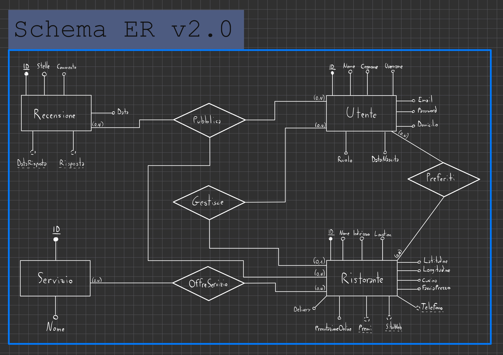

# Progettazione concettuale della base di dati
## Introduzione
Il presente documento descrive la progettazione concettuale della base di dati del sistema TheKnife. Partendo dal documento di analisi dei requisiti, vengono identificate le entità del dominio, i loro attributi, le relazioni che le legano e i vincoli che ne regolano il comportamento. Il risultato di questa fase è lo schema Entità-Relazione (ER), che costituisce la base per la successiva progettazione logica e l'implementazione in PostgreSQL.

## Entità
### Utente
ATTRIBUTI
- **ID**: intero, obbligatorio, chiave primaria, generato dal sistema
- Nome: stringa, obbligatorio
- Cognome: stringa, obbligatorio
- Username: stringa, obbligatorio, univoco
- Email: stringa, obbligatorio, univoco
- Password: stringa, obbligatorio, memorizzata come hash SHA-256
- Domicilio: stringa, obbligatorio
- DataNascita: data, obbligatorio
- Ruolo: enumerazione {CLIENTE, RISTORATORE}, obbligatorio
### Ristorante
ATTRIBUTI
- **ID**: intero, obbligatorio, chiave primaria, generato dal sistema
- Nome: stringa, obbligatorio
- Indirizzo: stringa, obbligatorio
- Location: stringa, obbligatorio
- Latitudine: numero decimale, obbligatorio
- Longitudine: numero decimale, obbligatorio
- Cucina: stringa, obbligatorio
- FasciaPrezzo: enumerazione ordinata {1, 2, 3, 4}, obbligatorio
- Telefono: stringa, opzionale
- SitoWeb: stringa, opzionale
- Premi: stringa, opzionale
- PrenotazioneOnline: booleano, obbligatorio
- Delivery: booleano, obbligatorio
### Servizio
ATTRIBUTI
- **ID**: intero, obbligatorio, chiave primaria, generato dal sistema
- Nome: stringa, obbligatorio, univoco
### Recensione
ATTRIBUTI
- **ID**: intero, obbligatorio, chiave primaria, generato dal sistema
- Stelle: intero {1..5}, obbligatorio
- Commento: stringa, obbligatorio
- Data: data, obbligatorio
- Risposta: stringa, opzionale
- DataRisposta: data, opzionale
## Relazioni
### Gestisce
Un Utente con ruolo RISTORATORE gestisce un Ristorante.
- Un ristorante ha 0..1 gestori
- Un ristoratore gestisce 0..N ristoranti

### Pubblica
Un Utente con ruolo CLIENTE pubblica una Recensione su un Ristorante.
- Un cliente può pubblicare 0..N recensioni
- Una recensione appartiene a esattamente 1 cliente e a esattamente 1 ristorante
- Un ristorante può ricevere 0..N recensioni

### Preferiti
Un Utente con ruolo CLIENTE salva un Ristorante tra i preferiti.
- Un cliente può salvare 0..N ristoranti
- Un ristorante può essere salvato da 0..N clienti

### OffreServizio
Un Ristorante offre un Servizio.
- Un ristorante può offrire 0..N servizi
- Un servizio può essere offerto da 0..N ristoranti
## Vincoli aggiuntivi
1. **Stelle**: il valore deve essere compreso tra 1 e 5 inclusi.
2. **Risposta e DataRisposta**: i due attributi sono vincolati insieme — se uno è assente, l'altro deve essere assente.
3. **Ruolo nelle relazioni**: solo un Utente con ruolo CLIENTE può partecipare alle relazioni Pubblica e Preferiti. Solo un Utente con ruolo RISTORATORE può partecipare alla relazione Gestisce.
4. **Unicità recensione**: un Utente con ruolo CLIENTE non può pubblicare più di una recensione per lo stesso Ristorante.
5. **Risposta autorizzata**: solo il gestore del Ristorante recensito può inserire una risposta a una Recensione. Questo vincolo non è esprimibile direttamente nel modello ER né in SQL — viene enforced lato server nella logica applicativa.
## Glossario dei termini

| Termine | Descrizione | Sinonimi | Collegamenti |
|---|---|---|---|
| Utente | Persona registrata al sistema. Si distingue in Cliente o Ristoratore in base al ruolo. | — | Recensione, Ristorante |
| Ospite | Utente non autenticato. Può ricercare ristoranti e visualizzare recensioni ma non interagire con il sistema. | Utente non registrato | Ristorante, Recensione |
| Cliente | Utente autenticato che può recensire ristoranti e gestire una lista preferiti. | Utente registrato | Recensione, Preferiti, Ristorante |
| Ristoratore | Utente autenticato che può inserire ristoranti, prenderne in gestione di esistenti e rispondere alle recensioni. | Gestore | Ristorante, Recensione |
| Ristorante | Esercizio di ristorazione presente nel sistema, caratterizzato da attributi geografici, di servizio e di categoria. | Locale, Esercizio | Utente, Recensione, Servizio |
| Recensione | Valutazione espressa da un Cliente su un Ristorante, composta da un voto in stelle (1–5) e un testo. | Valutazione | Cliente, Ristorante |
| Risposta | Testo inserito dal Ristoratore in replica a una Recensione ricevuta su un proprio ristorante. | — | Recensione, Ristoratore |
| Preferiti | Lista personale di ristoranti salvati da un Cliente. | Lista preferiti | Cliente, Ristorante |
| Servizio | Caratteristica aggiuntiva offerta da un Ristorante, scelta da un vocabolario predefinito. | — | Ristorante |
| Geolocalizzazione | Determinazione della posizione geografica di un utente o di un ristorante tramite coordinate o indirizzo. | Posizione, Localizzazione | Ristorante, Cliente |
| Fascia di prezzo | Indicatore del livello di costo medio di un ristorante, espresso su scala ordinata da 1 a 4. | Prezzo, Costo | Ristorante |
| Tipologia di cucina | Categoria gastronomica che descrive lo stile culinario di un ristorante. | Cucina | Ristorante |
| Credenziali | Coppia username e password usata per autenticare un utente nel sistema. | — | Cliente, Ristoratore |
| Hash SHA-256 | Funzione crittografica usata per memorizzare le password in forma non reversibile. | — | Utente |

## Schema ER
